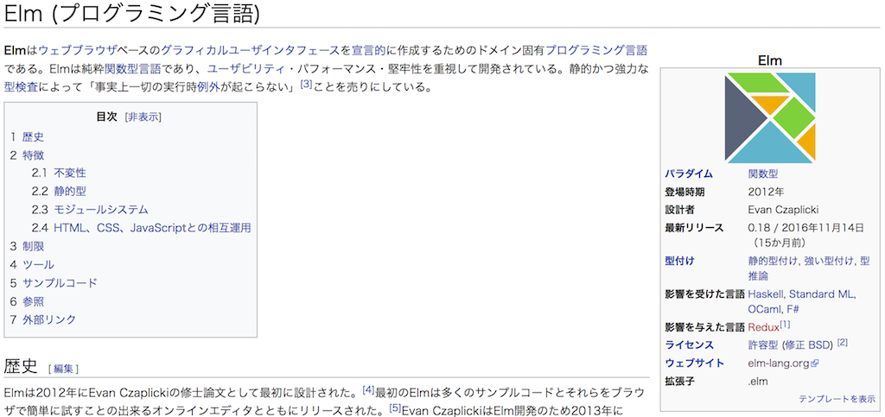
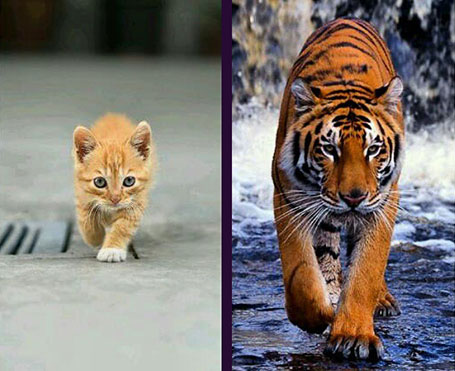
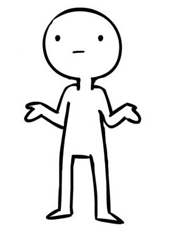
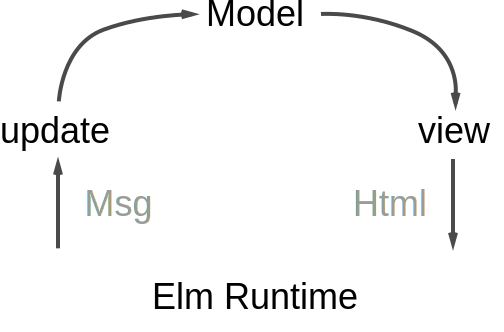

title: Elm vs. JS
class: animation-fade
layout: true

<!-- This slide will serve as the base layout for all your slides -->
.bottom-bar[
  {{title}}
]

---

class: center, middle
background-image: url(elm-logo.png)

.impact[
# {{title}}
## (and React and Redux)]


---
class: impact
background-image: url(tree.jpg)

# Elmとは

---



---
.col-4[


http://elm-lang.org  

作者：
Evan Czaplicki
https://github.com/evancz
]
## 特徴：
- ウェブブラウザベースのグラフィカルユーザインタフェースを作成

--
- 純粋関数型言語

--
- ユーザビリティ・パフォーマンス・堅牢性を重視

--
- 静的かつ強力な型検査

--
- 実行時例外が起こらない

---

## 関数型プログラミングの世界

.col-6[
#### General-purpose（汎用言語）
- Haskell
- Lisp
- OCaml
- F#
- Clojure
- Scala
- ...

]
.col-6[
#### Front end
- GHCJS (Haskell)
- Clojurescript
- PureScript
- Elm
- ...
]

---
class: impact

## Elmは関数型プログラミングへの
## ゲートウェイドラッグ


---

# JSにおける関数型プログラミングスタイル

--
.center-container-6[

#### 少し前
```js
var value;
if (condition === true) {
    value = something;
} else {
    value = somethingElse;
}
```
]
--
.center-container-6[
#### 最近の書き方
```js
const value = (condition === true)
    ? something
    : somethingElse;
```
]


---

.center-container-7[
```js
for (var i = 0; i < mylist.length; i++) {
    mylist[i] = doSomething(mylist[i]);
}
```
]
--
.center-container-7[
↓  
```js
mylist.map(item => doSomething(item));
```
]

---

.center-container-7[
```js
var sum = 0;
for (var i = 0; i < mylist.length; i++) {
    sum += mylist[i];
}
```
]
--
.center-container-7[
↓  
```js
mylist.reduce((sum, item) => sum + item);
```
]
---

### Elmでは

.center-container-6[
#### JS
```js
const value = (condition === true)
    ? something
    : somethingElse;
```
]
--
.center-container-5[
#### Elm
```elm
value =
  if condition == True then
      something
  else
      somethingElse
```
]
---
.center-container-6[
```js
const value = (condition === true)
    ? something
    : (condition2 = false)
      ? somethingElse
      : somethingCompletelyDifferent;
```
]
--
.center-container-6[
↓  
```elm
value =
    if condition == True then
        something
    else if condition2 == False then
        somethingElse
    else
        somethingCompletelyDifferent
```
]

---

.center-container-7[
```js
mylist.map(item => doSomething(item));
```
]
--
.center-container-7[
↓  
```elm
List.map (\item -> doSomething item) mylist
```
]
--
.center-container-7[
```js
mylist.map(doSomething);
```
]
--
.center-container-7[
↓  
```elm
List.map doSomething list
```
]
---
.center-container-7[
```js
mylist.reduce((sum, item) => sum + item);
```
]
--
.center-container-7[
↓  
```elm
List.foldl (\item sum -> sum + item) 0 mylist
```
]
--
.center-container-7[
↓  
```elm
List.foldl (+) 0 mylist 
```
]
--
.center-container-7[
` (+) = \a b -> a + b `
]
---

class: impact
background-image: url(mountain.jpg)

# 不変なデータ

---

## JSと不変なデータ

--

.center[

]

---

.center.big[**const**]  
.center-container-5[
```js
> const obj = { a: 12, b: 13 }
undefined
> const obj2 = obj
undefined
> obj2.c = 4
4
> obj2
{ a: 12, b: 13, c: 4 }
> obj
{ a: 12, b: 13, c: 4 }
```
]
---

.center.big[**immutable.js**]  
.center-container-6[
```js
> const { List } = require('immutable')
undefined
> const mylist = List([1, 2, 3])
undefined
> const mylist2 = mylist
undefined
> mylist.push(4)
List([1, 2, 3, 4])
> mylist2
List([1, 2, 3])
> mylist
List([1, 2, 3])
```
]

---

.center.big[**immutable.js vs. Elm**]  
.col-6[
## JS
```js
> const { List } = require('immutable')
undefined
> const mylist = List([1, 2, 3])
undefined
> const mylist2 = mylist
undefined
> mylist.push(4)
List([1, 2, 3, 4])
> mylist2
List([1, 2, 3])
> mylist
List([1, 2, 3])
```
]
.col-5.space-left[
## Elm
```elm
> mylist = [1, 2, 3]
[1,2,3] : List number
> mylist2 = mylist
[1,2,3] : List number
> 4 :: mylist
[4,1,2,3] : List number
> mylist2
[1,2,3] : List number
> mylist
[1,2,3] : List number
```
]

---

# Elmのデータ

.row[
.col-5[
```js
const list = [1, 2, 3]
```
]
.col-1[ .center[ <br /> → ] ]
.col-6[
```elm
list = [1, 2, 3]
```
]
]
--
.row[
.col-5[
```js
const tuple = ["id", 131, false]
```
]
.col-1[ .center[ <br /> → ] ]
.col-6[
```elm
tuple = ("id", 131, False)
```
]
]
--
.row[
.col-5[
```js
const record = {
    id: 131,
    name: 'Gergely',
    username: 'gszabo',
}
```
]
.col-1[ .center[ <br /> → ] ]
.col-6[
```elm
record =
    { id = 131
    , name = "Gergely"
    , username = "gszabo"
    }
```
]
]
---

#### 型定義をつける

.center-container-8[
```elm
list : List Int
list = [1, 2, 3]
```
]
.center-container-8[
```elm
tuple : (String, Int, Bool)
tuple = ("id", 131, False)
```
]
.center-container-8[
```elm
record : { id : Int, name : String, username : String }
record =
    { id = 131
    , name = "Gergely"
    , username = "gszabo"
    }
```
]
---

.center-container-8[
```elm
record : { id : Int, name : String, username : String }
record =
    { id = 131
    , name = "Gergely"
    , username = "gszabo"
    }
```
]

.center-container-8[
```elm
type alias Person =
    { id : Int, name : String, username : String }
  
record : Person
record =
    { id = 131
    , name = "Gergely"
    , username = "gszabo"
    }
```
]

---

# Union types (ユニオン型)

.center-container-6[
```elm
type State
    = Working
    | Eating
    | Sleeping
```
]
--
.center-container-6[
```elm
type alias Person =
  { name : String, state : State }

person =
  { name = "Gergo"
  , state = Sleeping
  }
```
]
---

.center-container-6[
```elm
saySomething : State -> String
saySomething state =
    case state of
        Working ->
            "Working hard man..."

        Eating ->
            "Yum"

        Sleeping ->
            "Zzzz"
```
]

---

# Elm architecture
.col-6[

]

--
1. **Model**: データ（ReduxのStore）

--
2. **view**: HTMLを作成する関数（Reactのrender)

--
3. **Elm runtime**: Virtual DOMを利用して必要な変更だけをDOMで行う(React Virtual DOM)

--
4. **Msg**: ユーザーインターアクションによってメッセージが生成される(Reduxのaction)

--
5. **update**: メッセージを受け取り、Modelを変更する（Reduxのreducer)

---

class: impact

時間があれば
# DEMO


.small[
https://github.com/Gege251/elm-examples/blob/master/minimalist-todo/App.elm
]
---
class: impact

# 感想

--


---

# 感想 

.col-6[
#### Pros
- 関数型言語
- バグ、エラー発生しにくい
- リファクタリングが楽
- 強制的セマンティックバージョンイング
- エラーメッセージがわかりやすい
- 1つの問題に対して1つの解決方法
]
.col-6[
#### Cons
- コミュニティーが小さい
- 学習コスト高め
- DOMを直接操作できない
]

---

class: center


???


実行時エラーがない、ファイルサイズがわけわからないほど小さい、弊社のコードベースの中で何よりも速い。しかもバグも少なくなった。

ということで、これからの新しいコードは全てElmで書くようマネージャーから支持さた。

---

# 使ってみたいと思ったら 

.center-container-7[
```jsx
import Elm      from 'react-elm-components';
import { Chat } from '../dist/elm/chatroom.js';

function render() {
  return <Elm src={Chat} />;
}
```
]
.col-6[
http://elm-lang.org/try  

https://ellie-app.com/  

http://elmrepl.cuberoot.in  

http://elm-lang.org/docs/from-javascript
]
.col-6[
https://github.com/evancz/react-elm-components

https://guide.elm-lang.org/install.html  

https://github.com/Gege251/elm-examples
]

